# Airbnb in Seattle

Since 2008, guests and hosts have used Airbnb to travel in a more unique, personalized way. As part of the Airbnb Inside initiative, this dataset describes the listing activity of homestays in Seattle, WA.

## Dataset
The Seattle Airbnb Open data can be found at kaggle [here](https://www.kaggle.com/airbnb/seattle).
The following Airbnb activity is included in this Seattle dataset:

* Listings, including full descriptions and average review score
* Reviews, including unique id for each reviewer and detailed comments
* Calendar, including listing id and the price and availability for that day

## Data Analysis 

#### Data Pre-processing / Cleaning
Drop unnecessary features (eg scraper id scrape date, listing url, picture urls, hosturl, host thumbnail, host pic etc).
Drop NaN values for catgegorical features, replace Nan values with statistical means for numerical features.
Format data (eg. drop $ for price).
One hot encode amenities.
Derive feature Revenue.
#### Exploratory Analysis for Feature Selection
Explore which of the features has the highest correlation with listing price.
Explore categorical variables (value counts, count plots, swarm plots).
Explore numeric variables (statistical analysis, boxplots, displots, violinplots, heatmap, joinplot). 

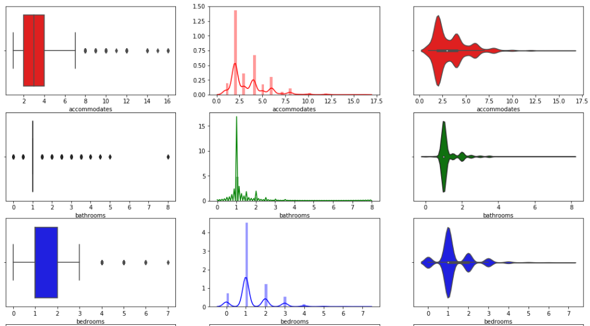 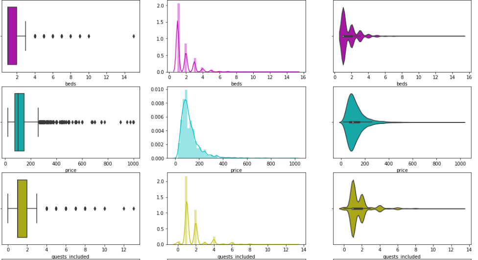 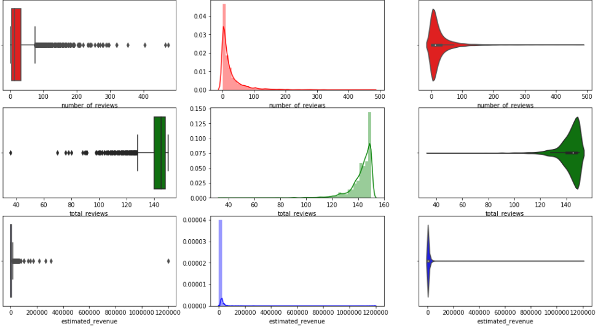

 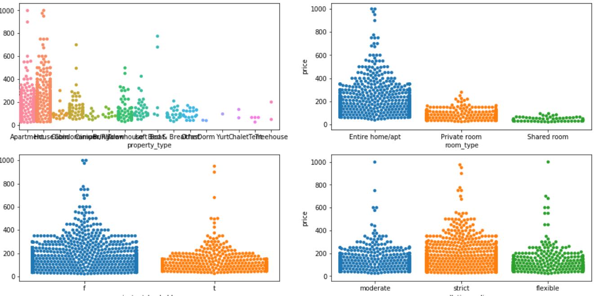 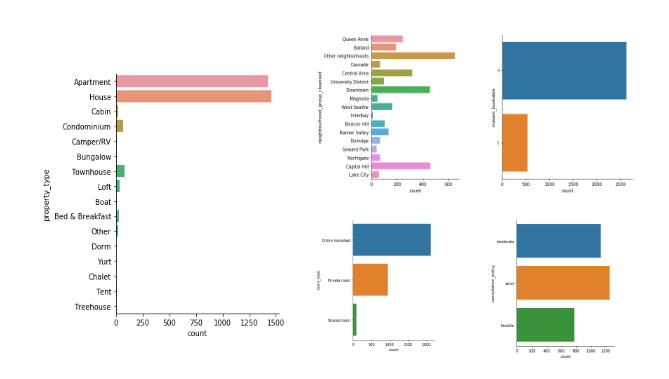 
 

 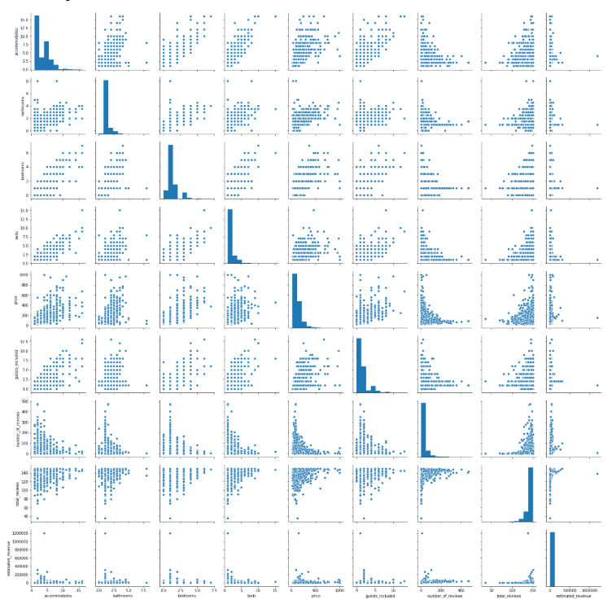 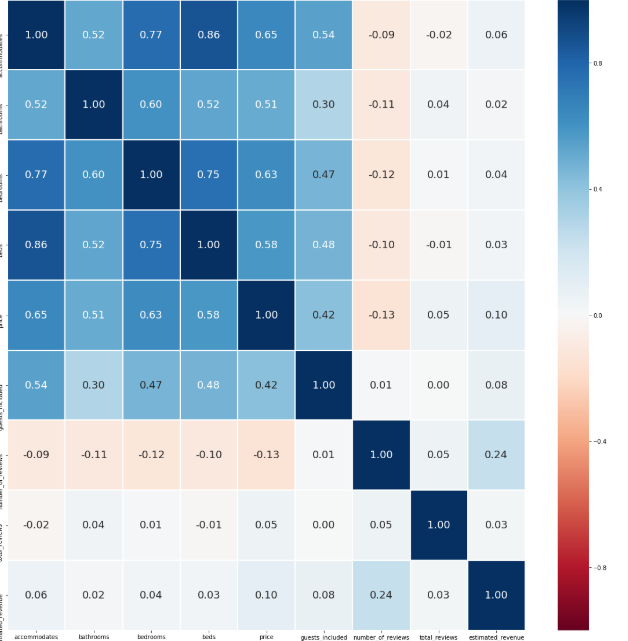 

Visualise the bookings clusters with map of Seattle using _GeoPandas_ library and _Folium_ map.

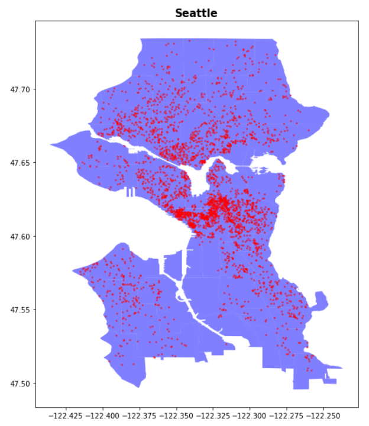 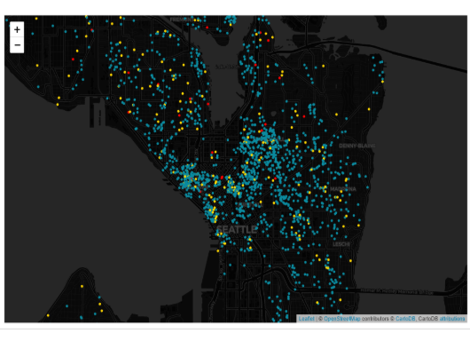 

#### Sentiment Analysis
Clean textual data : Convert summary objects into strings. Ensure same capitalisation. Use regex to remove non alphanumeric characters and numbers. Remove stopwords (i, and, we etc) which are frequently occuring words that do not contribute to sentiment. Convert stemmed words to root words and lemmatize them. 

Apply VADER sentiment intensity analyser to obtain compound VADER polarity scores, to identify words that strongest influence sentiment. 
Generate heat maps for frequency of positive and negative words, with VADER polarity scores.

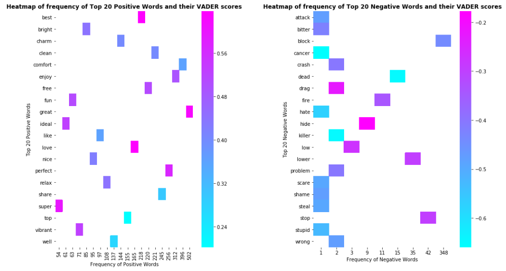 

Visualise the top aggregated positive words used in summary using Text Cloud.

 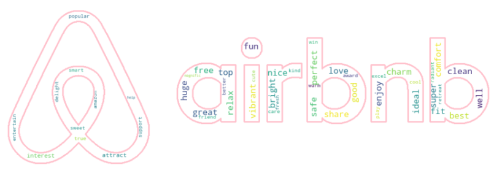 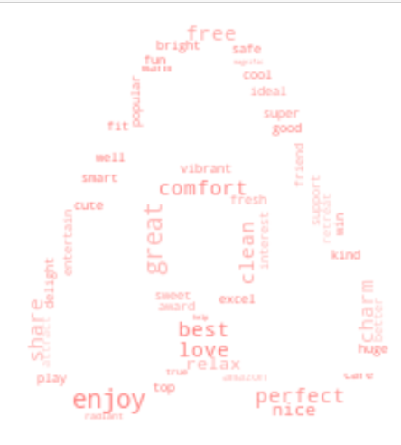 

#### Machine Learning
Implement feature scaling. Attempt multivariate regression to predict listing price. Training approaches adopted are RandomForestRegressor and XGBRegressor (Boosted Trees). Evaluate model accuracy for both Train and Test data using _Mean Squared Error (MSE)_ and _R2_.

## Objectives

The primary goals of this comprehensive analysis are:
* Determining best predictors of listing price, and modelling a multi-variate listing price predictor.
* Sentiment analysis on listing summary and advise host on how to best advertise their listing.
* Predicting important features for price determination.

## Insights

* Geographically, Airbnb listings are scattered around Seattle evenly, with two main clusters: Central District and Downtown Seattle. 
* Easier to visualise listing clusters using GeoPandas as opposed to Folium map.
* Surprisingly, despite being able to identify cluster centres, expensive listings ($500 to $1000) are not notably clustered at any area. Hence, price is not a valuable factor in determining the location. 
* Most frequently used words might not contribute that highly to overall sentiment. 
* No strong correlation between listing description sentiment polarity score with estimated revenue or listing price.
* Price and Revenue are not affected by overall rating. 
* Best predictors for listing price, with strongest correlations, are : neighbourhood_group_cleansed,  property_type,   room_type,  accommodates, bathrooms,  bedrooms, beds,  guests_included, Heating,  Internet, Kitchen,  Smoke Detector,  Washer, Wireless Internet. 
